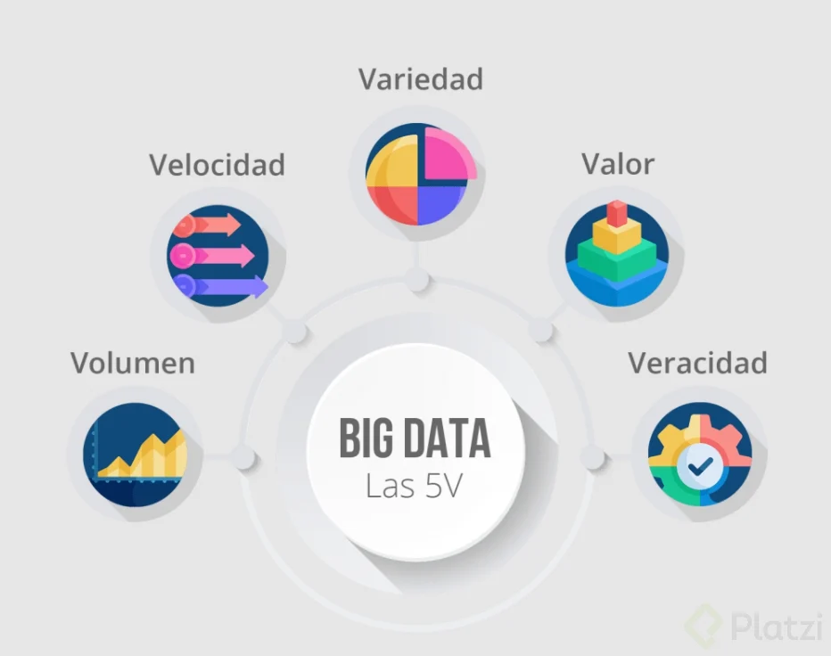
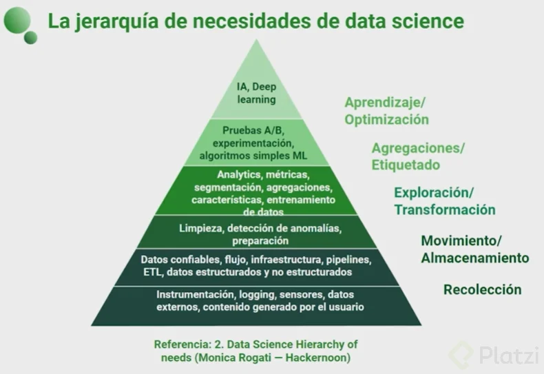
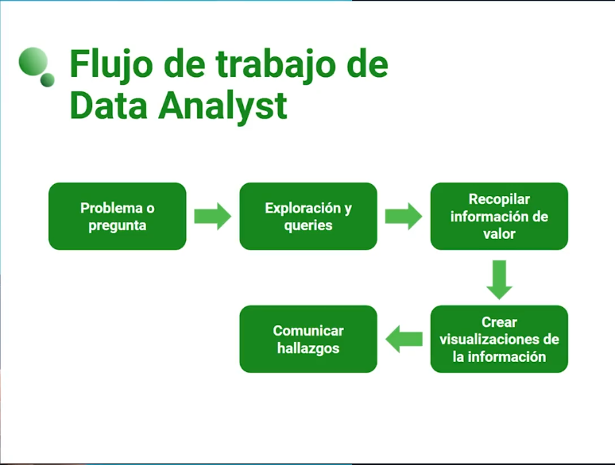
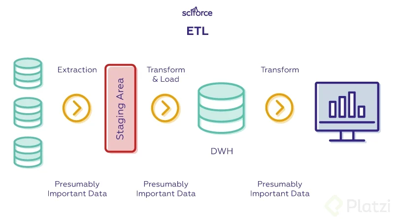

# Roles en el manejo de datos 

[Conceptos base](#data-science)

[Roles](#data-analyst)

# Conceptos base

## Data Science
Es el conjunto de practicas para analizar los datos y de esa forma poder generar predicciones y tomar desiciones.

## Inteligencia artificial
algoritmos que emulan el pensamiento humano reconociendo patrones en una gran cantidad de datos para poder posteriormente aprender y analizar futuros casos.

## Machine Learning
Rama de la inteligencia artificial que se enfoca en el entrenamiento para generar un modelo que permita hacer alguna prediccion

## Big Data
Grandes volumenes de datos de gran variedad que no permite un analisis tradicional. Debe cumplir con las 5 V para ser big data:
  - Volumen: gran cantidad de datos almacenados
  - Velocidad: Los datos se generan en tiempo rear y por lo tanto se deben analizar a una velocidad similar 
  - Variedad: La informacion viene de distintas fuentes y puede tener distintos formatos
  - Veracidad: Los datos son confiables
  - Valor: Los datos deben de poder proporcionar valor o beneficio para la empresa

## Consideraciones para el Data Science
  * Se necesita una infraestructura para que funcione 
  * Data science trbaja en conjunto con la inteligencia artificial
  * Se usan matematicas con otras herramientas 
  * La materia prima no es obligatorio que sea Big Data
  * Se trabaja con mucho en limpiar datos 

## Aplicación del data science
  * Machine learning
  * Deep Learning: en base a redes neuronales se puede emular comportamiento humano
  * RPA: Automatizacion de procesos 
  * Procesamiento de imagenes
  * Procesamiento del leguaje natural (asistentes, traductores, etc).
  * Robotica

El data science se puede aplicar a muchas ramas como la industria, la salud, etc.

## Equipos de data science
Existen varios roles dentro de los equipos para data science
  - Data engineer: Encargado de la limpieza de datos
  - Data analyst: analizan los datos limpios para poder encontrar areas de oportunidad
  - Data scientist: crean los modelos de machine learning
  - ML engineer: pulen el modelo de ML para implementarlo en produccion
  - Research scientist: Estudia nuevos algoritomos y aplicaciones

## Jerarquia de necesidades de data science
Para esta rama hay actividades o elementos que tienen mayor necesidad y se debe
de satisfacer para poder ir a la siguiente

# Roles

## Data Analyst
Rol que tiene gran comunicacion en la empresa y que debe de estar al pendiente de que necesidades llegan a surgir.

Se realizan consultas a las bases de datos y se necesitan plasmar en diagramas o esquemas amigables para las demas areas.

### Herramientas y tecnologias
  - Conocimineto de BD
  - SW para la visualizacion de datos
  - Saber excel 
  - Lenguajes de programacion para manejo de datos (python o R)
  - Conocimiento de probabilidad y estadistica

## Data Scientist 
Toma una serie de datos para generar algoritmos de machine learning y generar informacion valiosa.

Tambien monotoriza la presicion de datos como automatiza los procesos para al final implementar esta informacion a los productos. 

### Herramientas y tecnologias
  - Python 
  - POO
  - interfaces de integracion de python (jupyter notebook)
  - bibliotecas (pandas, numpy, etc)
  - algoritmos de machine learning
  - bases de datos 
  - matematicas aplicadas (algebra, proba, estadistica, algebra lineal, calculo, etc.)

## Data Engineer
En base a datos sucion, el ingeniero de datos se encarga de limpiar los datos y poder aplicar esta informacion limpia para los demas roles

Los datos pueden proceder de varias fuentes y cargarlos en bases de datos especializadas (OLAP). Ya implementado el proceso se automatiza para poder mantener los datos actualizados.

El proceso que hace un data engineer se llama ETL (Extract, Transform, Load)

### Herramientas y tecnologias
  - Lenguajes de programacion con POO
  - conocimiento de ingenieria de sw
  - automatizacion por scripting (shell scripting)
  - bases de datos 
  - Tecnologias cloud
  - Contenedores
  - orquestadores
  - Estadistica descriptiva

## Machine Learning Engineer
Es el encargado de desplegar el modelo de machine learningn en produccion para poder escalar los modelos y aplicarse a nivel masivo mediante la validacion de los modelos y su robustecimiento 

### Herramientas y habilidades
  - lenguajes como python, java y c++
  - librerias de machine learning
  - librerias para desplegado como flask
  - uso de contenedores
  - tecnologias de la nube
  - matematicas aplicadas (estadistica, calculo, algebra lineal)
  

