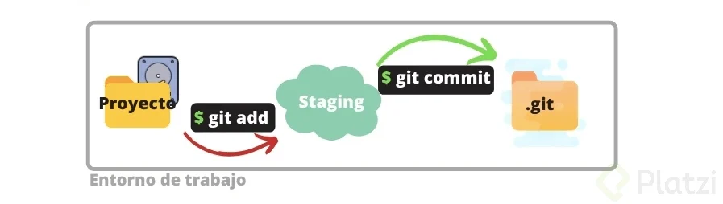

# Curso Git Hub
---
### Git
Git es un sistema de control de versiones. Esto es que en lugar de guardar toda una version de cierto archivo, lo que se guarda en realidad son los cambios hechos en el, de tal forma que se puede regresar a cierto punto para poder ver el estado de este archivo e incluso comparar entre puntos en el tiempo

Como nota se debe evitar el incluir binarios dentro de un repo, ya que por minimo que sea el cambio, el binario se debe de guardar completo, por lo cual es considerado una mala practica. Para guardar archivos binario se recomienda hacerlo en un CND.

### Iniciar un repositorio
Para iniciar un repositorio es necesario tener contemplada la carpeta principal de nuestro proyecto, luego posicionado en nuestra carpeta usamos el comando `git init`. Al ejecutar el comando, en automatico se crea la carpeta .git.

### Estado de un repositorio
Para saber el estado de un repo (la rama, los cambios, etc) se usa el comando `git status`. para añadir los cambios a la historia del repo usamos 
~~~bash
git add [rutaArchivo]|.
~~~

### Eliminar un archivo del historial
Para eliminar un archivo usamos
~~~bash
#elimina el registro de la base pero lo regresa a como estaba antes del add
git rm --cached [rutaArchivo]
~~~

Al momento de usar el comando add se llega a una fase en git llamada _stage_. Se podria considerar el intermedio entre un nuevo archivo y su inclusion en la base de cambios

### Confirmar cambios
Para confirmar los cambios con el fin de poder añadir los cambios usamos `git commit`. Como buena practica se recomienda añadir comentarios.
~~~bash
git commit -m "[comentarioSobreElCambio]"
~~~

### Configuracion de git
La primera vez que se usa git no se tiene conocimiento de quien esta realizando los cambios, por lo cual se debe de configurar esto, para lo cual usamos el comando `git config`
~~~bash
#Muestra todos las configuraciones y sus valores actuales
git config --list

#Ver donde se encuentran almacenadas las configuraciones
git config --list --show-origin

#Colocar un valor de configuracion de forma global
git config --global [configuracion] "[valor]"
~~~

### Historial de cambios
Para ver los cambios hechos en una seccion en especifico usamos el comando `git log`
~~~bash
#Caracteristicas generales de los commits
git log [archivo]

#Mostrando las caracteristicas especificas de los commits
git log --stat [archivo] 
~~~

__NOTA__: El primer registro que arroja el comando es el cambio mas reciente

### Comarar los cambios en las versiones
Para ver los cambios entre las ultimas dos versiones se usa el comando `git show` mas el archivo de interes

Si se desea comparar entre dos versiones arbitrarias se usa `git diff`
~~~bash
git diff [versionOriginal] [versionMasNueva]
~~~

### Estados de un repo
Un repo, durante el proceso de cambios se pasa por ciertas fases:
  
  - Untracked: En esta fase el archivo tiene cambior realizados, pero aun no estan dentro de la base de datos.
  
  - staged/tracking: En esta fase los cabios estan tomados en cuenta, pero no estan registrados en la base de datos, si no estan almacenados dentro de memoria RAM. Se llega a esta fase al ejecutar el comando `git add`

  - almacenado: En esta fase estan confirmados los datos y se encuentran registrados en la base de datos con un numero de identificación. A esta fase se llega al momento de usar el comando `git commit`

Como elemento final, es posible regresar a cierto momento antes del cambio y estar de nuevo en la fase de untracked se usa el comando `git checkout`

### Ramas
Una rama es un conjunto de cambios dentro de la base que estan uno delante de otro, generando un historial de cambios. Al momento de crear un repo se genera una rama por defecto (rama master).

__NOTA__: Al cambio mas actual dentro de cualquier rama se llama HEAD

Es posible tener mas de una rama dentro del mismo repositorio, los cuales se pueden desarrollar de manera paralela una de otra. En caso de que se desee fusionar una o mas ramas se hace con el comando `merge`. Algo muy importante a considerar es que se debe de tener un control dentro de las ramas, ya que en si dos de ellas trabajan en los mismos archivos, puede sobrescribir el contenido de estos; A este suceso se le llama __Conflictos__.

Para poder regresar a cierto commit se usa el comando `reset`
~~~bash
#Reinicio duro: Se van a eliminar tanto los commits posteriores como los cambios dentro de stage
git reset --hard [identificadorCommit] 

#Reinicio suave: Retorna al commit deseado pero manteniendo los cambios en stage
git reset --soft [identificadorCommit]  
~~~

Para solo regresar y ver el estado de un archivo en la rama, pero sin eliminar los demas commits se usa `checkout`
~~~bash
#Ir a un checkout anterior
git checkout [identificadorCommit]

#Regresar al commit mas actual 
git checkout master
~~~

### Repositorio remoto
Este es un repositorio en el cual existen muchos colaboradores quienes realizan cambios o añaden nuevos elementos y funcionalidades. Este repositorio se encuentra en un servidor en especifico, pero en el cual se puede acceder de forma remota; Para poder empezar a trabajar en este se usa el comando `git clone`. Al clonar este repo se podran hacer modificaciones como se ha visto en el caso de un repo local, pero para poder hacer que los commits se reflejen para todos los integrantes se debe de usar un comando adicional, el cual es `git push`.

En el caso de que se desee actualizar la copia local del repo con los ultimos commits que se han hecho por los demas se requiere de dos comandos. Primero se necesitan descargar estos cambios dentro del repo local (la carpeta .git) usando el comando `git fetch`. Ya descargados los commits, se fusionan con el repositorio local para ver dentro del directorio de trabajo estos cambios, para lo cual usamos el comando `git merge`

__NOTA__: Existe un comando el cual realiza las mismas actividades que los dos anteriores, el cual es `git pull`.

