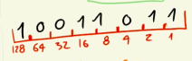

## Que son los bit y bytes
La electricidad tiene forma de onda y al poder manipularla se podria tranformar para enviar y recibir informacion como por ejemplo:

  * Sonido 
  * television
  * texto: Mediante sonidos altos y bajos 

La minima expresion matematica eran los altos (1) o bajos (0) tiene por nombre bit

Para poder representar un caracter se opto por crear una lista que relacionara un numero de esta lista con algun caracter asociado.

Como estandar se establecieron por defecto bloques de 8 bits para poder almacenar los codigos de los caracteres (bytes)

Las posiciones dentro del byte representan el valor en base dos

En esta clasificacion existen bytes especiales que especifican acciones para el procesador y este pueda ejecutar

## Circuitos electronicos
la electricidad permite la conversion de ondas electricas en diferentes manifestaciones (luz, sonido, informacion, etc.)

Lo fundamental a considerar en la electronica es el concepto de voltaje, corriente y resistencia.

La electricidad permite ejecutar instrucciones para convertir un dato a otro

## Arquitectura
Los computadores (de escritorio o una lapop) internamenten tienen los siguientes componenetes
  * CPU: Los procesadores trabajan en frecuencia de ondas (Ghz), es decir, la velocidad con la que procesan la informacion. Tambien los procesadores estan compuestos por nucleos que indica cuantas instrucciones pueden ejecutarse al mismo tiempo.

  Los CPUs requiere que se ingrese informacion para que pueda ejecutar las operaciones

  * BIOS: son pequeños chips que contiene la informacion basica del equipo para que el CPU comprenda el contexto y los elementos con los que va a interactuar

  * Disco duro: Es uno de los dispositivos con los que trabaja el CPU. El disco duro alamacena informacion y en este se almacena el sistema operativo. Existen dos tipos de almacenamiento
    
    * Disco duro
    * Disco de estado solido

  * RAM: Entre el disco duro y el cpu existe un intermediario que almacena temporalmente la informacion de los programas que necesitan el procesamiento del CPU y tiene la ventaja de poder trabajar a una gran velocidad.  

Con la conbinacion del disco duro, la ram y el cpu se puede interactuar con demas elementos como la pantalla, el mouse, la impresora, etc.

En el caso de la pantalla se cuenta con un chip especial llamado GPU que es la encaragada de procesar en paralelo todos los datos a mostrar en el dispositivo. La gpu trabaja con operaciones especificas para poder procesar las imagenes.

## System on a chip
Para el caso de dispositivos es necesario el compactar toda la arquitectura de las computadoras. En este modelo se busca tener toda la arquitectura principal (CPU, BIOS y RAM) en un solo elemento. A esta arquitectura se le llama System on a chip.

Como los dispositivos mobiles trabajan con elementos inalambricos (Bluetooth, wifi, etc) se tiene un sector enfocada a ello.

En el caso de estos dipositivos tambien trabaja con perifericos, pero en este caso se conectan directamente al system on a chip y asi poder conocer su entorno

## Almacenamiento
Existen dos tipos de almacenamiento
  
  * Almacenamiento persistente: no importa si cuenta o no con electricidad la informacion los datos se conservan

  * Almacenamiento volatil: requieren de corriente electrica ara 

Los discos duros trabajan con almacenamiento persistente, asi como un sistema secuencial (Lee desde el inicio del archivo hasta el final) y estructurado (los archivos trabajan con un cierto formato para su lectura y escritura)

Los sistemas operativos tienen una estructura y proceso para acceder y crear archivos. a este conjunto de procedimientos se les llama sistemas de archivos.

Dentro de varios sistemas de archivos, al inicio del disco duro se tiene una estructura que permite saber la ubicacion, el tamaño y mas datos de los archivos llamados cabecera.

Dentro de la cpu se tiene una memoria de gran velocidad llamada cache, en el cual se almacenan datos que se necesitan de rapido acceso (programas, datos de archivos, etc.)

Las memorias RAM tienen el beneficio de compartir un indice que nos dicen las ubicaciones en la memoria donde hay datos (direccion de memoria). Estas direcciones de memoria trabajan de forma tal que el acceso a cualquier direccion de memoria se tarda lo mismo.

Para compartir informacion se requieren de cables o circuitos que reciben el nombre de bus de datos 